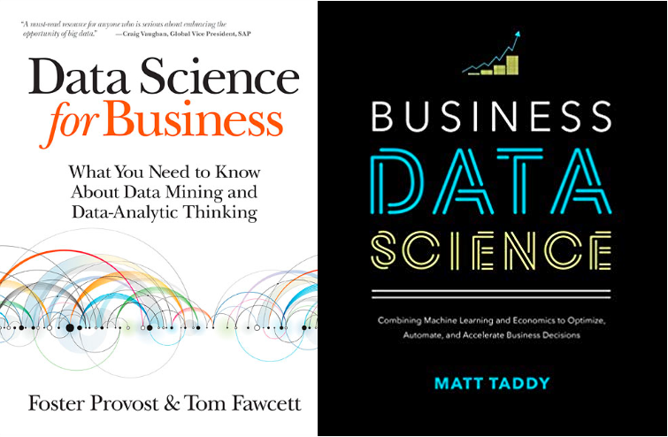
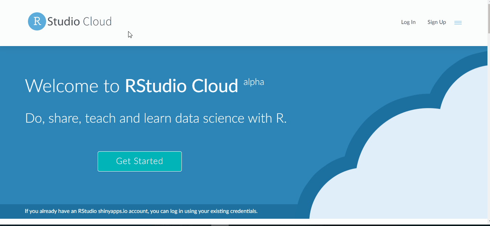
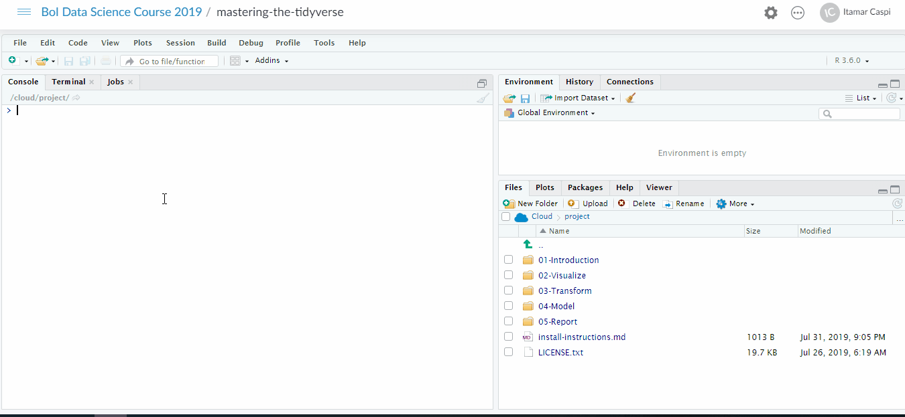

```{r setup, include=FALSE}
options(htmltools.dir.version = FALSE)
library(knitr)
knitr::opts_chunk$set(eval = TRUE, echo = TRUE, warning = FALSE,
                      message = FALSE, cache = FALSE)

htmltools::tagList(rmarkdown::html_dependency_font_awesome())
```

```{r plots_and_figures, include=FALSE}

library(ggplot2)
theme_set(theme_gray(15))

library(kableExtra)

```

```{r, references, echo=FALSE, cache=FALSE}
library(RefManageR)
BibOptions(check.entries = FALSE, 
           bib.style = "numeric", 
           cite.style = "authoryear", 
           style = "markdown",
           hyperlink = FALSE, 
           dashed = FALSE)
bib <- ReadBib("refs/refs.bib", check = FALSE)
```


class: .title-slide-final, center, inverse, middle

# 10-Year challenge

.big[
__2009: ML = Maximum Likelihood__  
__2019: ML = Machine Learning__
]


---

# An aside: about the structure of these slides

- This slide deck was created using the R package [xaringan](https://slides.yihui.name/xaringan/#44) (/ʃæ.'riŋ.ɡæn/) and [Rmarkdown](https://rmarkdown.rstudio.com/).

- Some slides include hidden comments. To view them, press __p__ on your keyboard

```{r, echo=FALSE, out.width = "80%", fig.align='center'}

knitr::include_graphics("figs/comments.gif")

```

???

Here is a comment


---

class: title-slide-section-gray

# Outline

1. [Logistics](#logistics)  

2. [About the Course](#about)

3. [To Do List](#todo)


---
class: title-slide-section-blue, center, middle
name: logistics

# Logistics


---
# Class website

The (unofficial) class website: [https://ml4econ.github.io/course-spring2019](https://ml4econ.github.io/course-spring2019/index.html)

```{r, echo=FALSE, out.width = "80%", fig.align='center'}

knitr::include_graphics("figs/homepage.gif")

```


---
# Discussion forum

We will use a [GitHub discussion repository](https://github.com/ml4econ/discussion-spring2019). To use it, you'll need to create a GitHub account and ask for an invitations from Itamar.  

```{r, echo=FALSE, out.width = "80%", fig.align='center'}

knitr::include_graphics("figs/discussions.gif")

```

???

Google and [StackExchange](https://stackexchange.com/) are typically the first places to look for answers for computational related questions. It is safe to always assume that you are not the first one to encounter your problem.

Nevertheless, we will also be using a private GitHub repository for class discussion. Please post there any questions or requests you may have that are relevant to all course participants, rather than emailing us. All of your classmates will benefit from the public discussions.

You can access our GitHub discussion repository [here](https://github.com/ml4econ/discussion-spring2019), but before you do, make sure that you have created a GitHub account (see instruction [here](https://ml4econ.github.io/course-spring2019/git.html)) and that you have received a collaboration invitations from me (Itamar). Shoot me an email if you haven't received an invitation.

---

# People

Lecturers:

- __Ariel Mansura__, Head of Statistical Methodology Unit, Information and Statistics Department.
  
  
- __Itamar Caspi__,  Head of Monetary Analysis Unit, Research Department.
  
Teaching Assistant:

- __Jonathan Rosen__, Statistical Methodology Unit, Information and Statistics Department.


* Meeting hours: after class, on demand.


---

# Feedback


This is the second time we run this course. Nevertheless, your continuous feedback is important!


Please contact us by

  - email  

  - in person  

  - open an issue on our forum (Best option)


---
class: title-slide-section-blue, center, middle
name: about

# About the Course

---

# Prerequisites

- Advanced course in econometrics / statistics.


- Some experience with R (or another programming language) are a major plus.


---

# This course is


.pull-left[

.big[__About__]

Tools of trade: R, Tidyverse, Git...

How and when to apply ML methods

  - Generate good quality predictions
  - Classify data objects  
  - Organize unstructured data

To do that we will need to understand

  - what is ML?
  - How it relates to stuff we already know?
  - How it differs?

]

.pull-right[

.big[__Not about__]

- Cutting-edge ML techniques (e.g., deep learning)

- Computational aspects (e.g., gradient descent)

- Data wrangling (a.k.a. "feature engineering")

- Distributed file systems (e.g., Spark) 


]

---

# Syllabus

| Week                  | Who                | Topic                                                                          |
|:----------------------|:--------------------|:---------------------------------------------------------------------------------|
| [**1**]      | Itamar | R, RStudio, git, and GitHub |
| [**2**]      | Itamar | Basic Concepts |
| [**3**]      | Ariel  | Regression and K Nearest Neighbors|
| [**4**]      | Ariel  | Regularization |
| [**5**]      | Ariel  | Classification |
| [**6**]      | Ariel  | Decision Trees and Random Forests| 
| [**7**]      | Ariel  | Unsupervised Learning|
| [**8**]     | Itamar | Text as Data |


> __NOTE__: This schedule might go through changes.

---

# Readings on ML

.pull-left[

A couple of suggestions:

- [An Introduction to Statistical Learning with Applications in R (ISLR)](http://www-bcf.usc.edu/~gareth/ISL)  
`r Citet(bib, "james2013introduction")`  
__PDF available online__ 

- [The Elements of Statistical Learning (ELS)](http://statweb.stanford.edu/~tibs/ElemStatLearn)  
`r Citet(bib, "hastie2009elements")`  
__PDF available online__  

]

.pull-right[

```{r books, echo=FALSE, out.width = "100%", fig.align='center'}

knitr::include_graphics("figs/books.png")

```

]

---

# Readings on Applied ML

.pull-left[

A couple of suggestions:

- [Business Data Science: Combining Machine Learning and Economics to Optimize, Automate, and Accelerate Business Decisions](https://www.amazon.com/Business-Data-Science-Combining-Accelerate/dp/1260452778)  
Taddy (2019) 

- [Data Science for Business: What You Need to Know about Data Mining and Data-Analytic Thinking](https://www.amazon.com/Data-Science-Business-Data-Analytic-Thinking/dp/1449361323)  
Provost and Fawcett (2013)  

]

.pull-right[

```{r bussines_books, echo=FALSE, out.width = "100%", fig.align='center'}



```

]


---

# Readings on ML and Economics

.pull-left[

<!-- - [The impact of machine learning on economics](https://www.nber.org/chapters/c14009.pdf) `r Citet(bib, "athey2018the")`   -->
<!-- In _The Economics of Artificial Intelligence: An Agenda_.   -->
<!-- University of Chicago Press.    -->

- [Machine Learning: An Applied Econometric Approach](https://www.aeaweb.org/articles?id=10.1257/jep.31.2.87) `r Citet(bib, "mullainathan2017machine")`  
_Journal of Economic Perspectives_, 31(2), 87-106.  

- [Machine Learning Methods Economists Should Know About](https://www.annualreviews.org/doi/abs/10.1146/annurev-economics-080217-053433) `r Citet(bib, "mullainathan2017machine")`  
_Annual Review of Economics_, 11, 625-725.  

]

.pull-right[

```{r susan_sendhil, echo=FALSE, out.width = "100%", fig.align='center'}

knitr::include_graphics("figs/susan_sendhil.png")

```
]


---

# Programming language


* Two of the most popular open-source programming languages for data science:  

  - [<i class="fab fa-r-project"></i>](https://www.r-project.org/)  
  
  - [<i class="fab fa-python"></i> Python](https://www.python.org/)  

* We choose R.  

* Why R? A matter of taste...

*  We do encourage you to try out Python. However, we will be able to provide limited support for Python users. 

* (Pro tip: You can use both! see the  [reticulate](https://rstudio.github.io/reticulate/) package.)


---

# RStudio Cloud


```{r cloud, echo=FALSE, out.width = "100%", fig.align='center'}



```


---

# RStudio Projects


```{r cloud2, echo=FALSE, out.width = "100%", fig.align='center'}



```


---

# Practice

- In-class problem sets.


- [Kaggle](https://www.kaggle.com/) prediction competition: predict median house value in Boston area.


---

# Kaggle

```{r kaggle, echo=FALSE, out.width = "100%", fig.align='center'}

knitr::include_graphics("figs/kaggle.gif")

```


---
class: title-slide-section-blue, center, middle
name: todo

# To Do List

---

# Homework<sup>*</sup>

<i class="fas fa-check-square"></i> Download and install [Git](https://git-scm.com/downloads).  

<i class="fas fa-check-square"></i> Download and install [R](https://cloud.r-project.org/) and [RStudio](https://www.rstudio.com/).  

<i class="fas fa-check-square"></i> Create an account on [GitHub](http://github.com/)

<i class="fas fa-check-square"></i> Download and install [GitHub Desktop](https://desktop.github.com/).  


<i class="fas fa-check-square"></i> Create an account on [Kaggle](www.kaggle.com) and ask Itamar to invite you the course's [prediction competition](https://www.kaggle.com/t/97eb0edcbe7c406882c7c067076bedd3).


.footnote[
[*] Please consult the [Guides](https://ml4econ.github.io/course-spring2019/RnRStudio.html) section in our course's website.
]


---
class: .title-slide-final, center, inverse, middle

# `slides %>% end()`

[<i class="fa fa-github"></i> Source code](https://github.com/itamarcaspi/boi-data-science-2019/blob/master/01-overview/01-overview.Rmd)  

---
# References

```{r, 'refs', results='asis', echo=FALSE, eval=TRUE}
PrintBibliography(bib)
```

